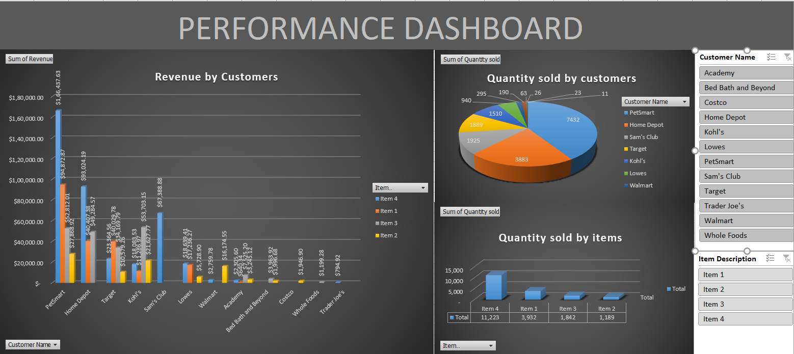

# Customer Sales Analysis (Power BI)

## Dashboard Preview

## Objective
Analyse revenue and quantity performance across customers and products
to identify top performers, best-selling items, and growth opportunities.

## Tools Used
Power BI · Excel

## Data Sources
| Table | Description |
|---|---|
| Customers | Customer name, region, segment |
| Orders | Order ID, date, customer, item, quantity, revenue |
| Items | Item ID, category |
| Time | Date, month, quarter, year |

## Key Metrics
| Metric | Description |
|---|---|
| Revenue by customer | Total revenue per customer over the period |
| Quantity by customer | Total items purchased per customer |
| Quantity by item | Total units sold per item |

## Key Findings
- **PetSmart** is the top performing retailer — $341,991 revenue, 7,432 units sold
- **Item 4** is the best selling product — 11,223 units, $392,798 revenue
- **Item 1** is second — 3,932 units, $204,473 revenue
- Kohl's revenue is heavily concentrated in a single item — high dependency risk
- Target and Home Depot show balanced revenue distribution across items

## Methodology
1. Data cleaning, merging, and validation
2. Aggregations to identify top customers and products
3. Revenue and quantity visualisation across segments
4. Comparative analysis across customers and items
